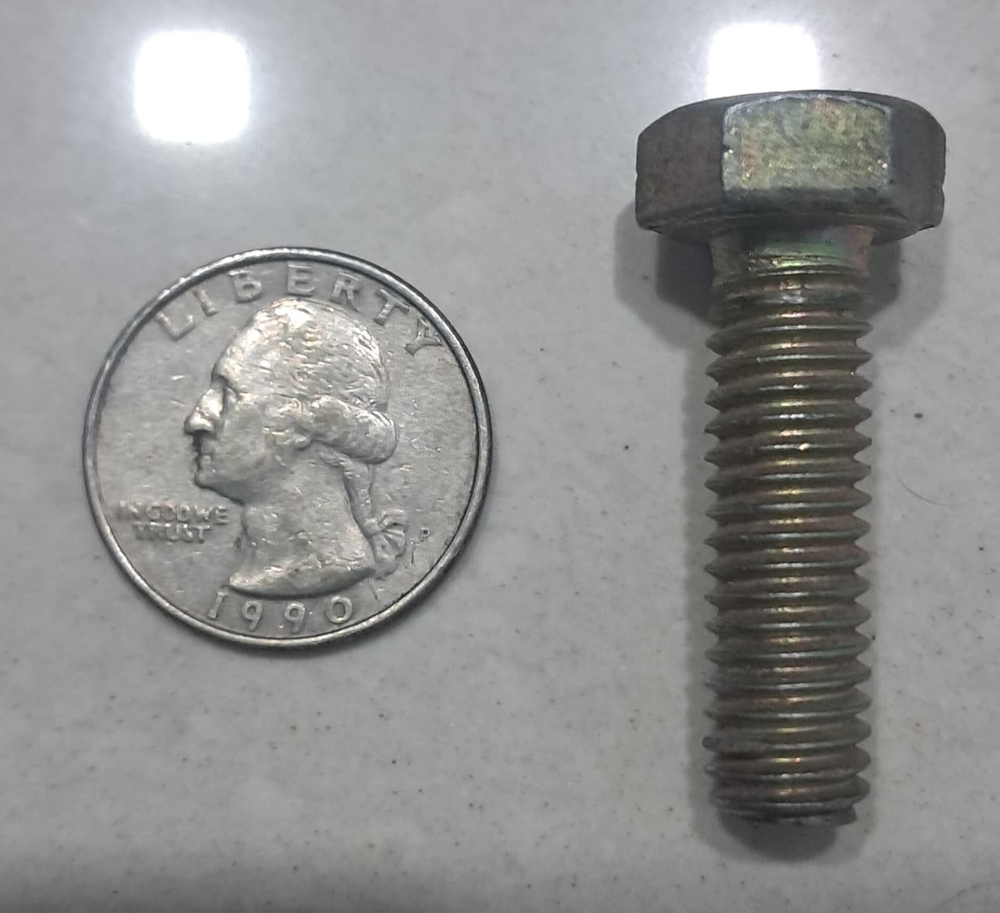
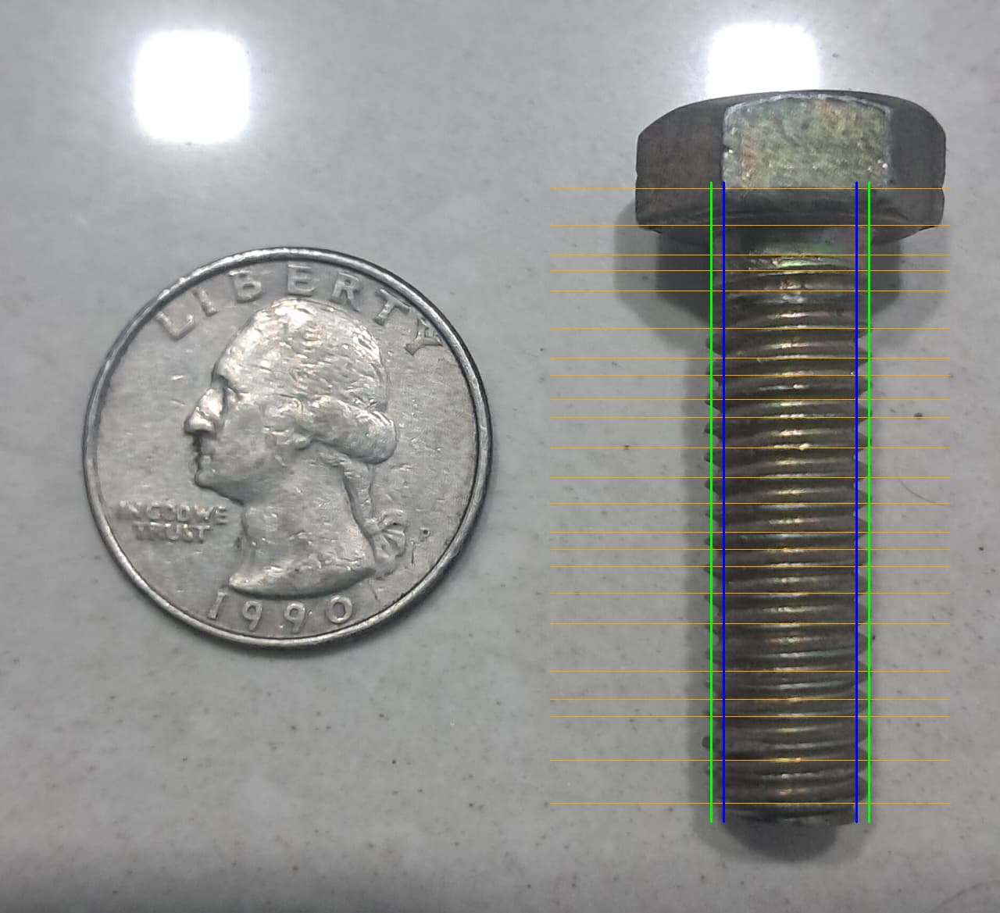

# ⚙️ Automated Bolt Measurement Using Computer Vision  

> A computer vision–based system that automatically measures the **major diameter, minor diameter, and pitch** of bolts from an image — using OpenCV, SciPy, and NumPy.  
> This project eliminates manual measurement errors and speeds up quality inspection in industrial workflows.  

---

## 🚀 Overview  

Manual bolt inspection is time-consuming and prone to human error.  
This project uses **image processing and computer vision** techniques to accurately measure bolt dimensions from an image using a reference object (coin) for scale calibration.  

The pipeline detects a reference coin to calculate the **pixels-per-millimeter (scale)** and then analyzes the bolt’s **crest and root diameters** to determine:  
- Major Diameter (mm)  
- Minor Diameter (mm)  
- Pitch (mm)  

Finally, it compares the measurements against standard M10 bolt tolerances to determine acceptance.  

---

## 🧠 Tech Stack  

- **Python 3.10+**  
- **OpenCV** – for image processing and edge detection  
- **NumPy** – for array and pixel manipulation  
- **SciPy** – for signal processing and peak detection  
- **Pandas** – for structured result logging  
- **Google Colab** – for runtime and visualization  

---

## 💡 Features  

✅ Automatic scale detection using reference coin  
✅ Edge-based bolt profile analysis  
✅ Thread pitch calculation via vertical projection peaks  
✅ CSV logging for all measurements and results  
✅ Visual overlay of all detected features  
✅ Works directly in Google Colab — no complex setup needed  

---

## 📸 Sample Results  

**Input Image → Output Visualization**

| Input Image | Processed Output |
|--------------|------------------|
|  |  |

*(Orange lines indicate thread crests used for pitch calculation.)*

---

## ⚙️ Run the Project  

### 🔗 **Try it instantly on Google Colab**  
[](https://colab.research.google.com/github/kaivalyad10/Automated-Bolt-Measurement-Using-Computer-Vision/blob/main/src/notebooks/bolt_measure.ipynb)

---

### 💻 **Run Locally**  

Clone this repo:
```bash
git clone https://github.com/kaivalyad10/Automated-Bolt-Measurement-Using-Computer-Vision.git
cd Automated-Bolt-Measurement-Using-Computer-Vision
